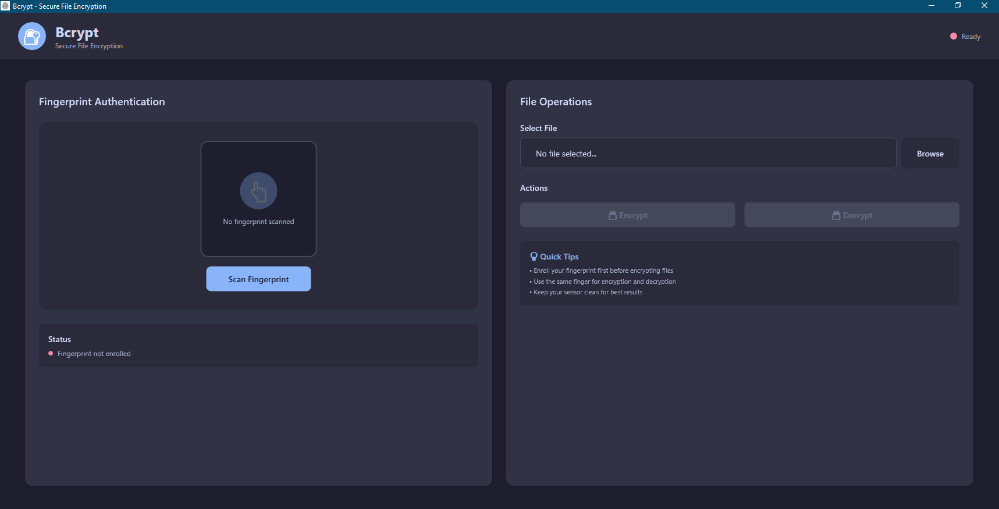
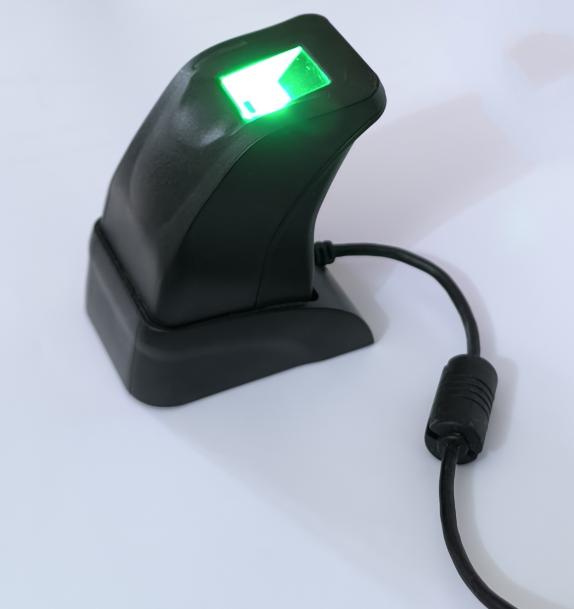
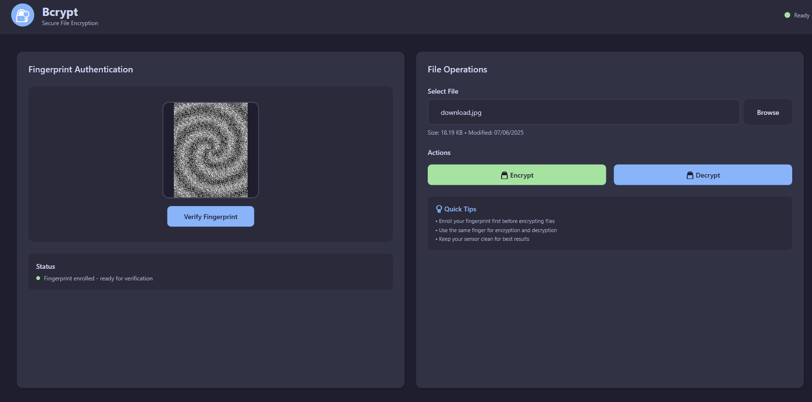

# Secure File Encryption Using Fingerprint-Derived Keys


## Overview

This project is a comprehensive application designed for secure file encryption and decryption. It leverages advanced cryptographic techniques, fingerprint-based authentication, and fuzzy extractors to ensure robust security. The application is built using .NET 8 and incorporates multiple libraries for modular functionality.

**Key Innovation**: Unlike traditional encryption systems, this application generates cryptographic keys directly from your fingerprint biometric data—no passwords to remember, no keys to store. Your fingerprint becomes your encryption key through advanced fuzzy extractor technology.



---

## Features

### 1. **Fingerprint Authentication**
   - Utilizes the `FingerprintLib` library for fingerprint scanning and template management.
   - Supports enrollment and verification of fingerprint templates.
   - Implements fuzzy extractors for secure key generation from biometric data.
   - **Multi-scan enrollment**: Three captures merged for optimal quality
   - **Intelligent method selection**: Hybrid approach adapts to fingerprint quality

### 2. **Fuzzy Extractor**
   - The `FuzzyExtractorLib` library provides functionality for generating cryptographic keys from noisy biometric data.
   - Ensures high reliability and security through Reed-Solomon error correction and quality-aware processing.
   - **Advanced error correction**: Reed-Solomon RS(96,32) encoding corrects up to 32 bytes of errors
   - **Quality-aware processing**: Adapts parameters based on fingerprint scan quality
   - **Reproducible keys**: Same fingerprint always generates the same 256-bit AES key

### 3. **File Encryption and Decryption**
   - The `CryptoLib` library handles file encryption and decryption using industry-standard cryptographic algorithms.
   - Supports secure key derivation and storage.
   - **AES-256 encryption**: Industry-standard symmetric encryption
   - **CBC mode**: Secure cipher block chaining with unique IVs per file
   - **Stream processing**: Efficient handling of large files

### 4. **WPF Application**
   - The `EncDecApp` project provides a user-friendly graphical interface for interacting with the encryption and decryption functionalities.
   - Includes features like file selection, encryption, decryption, and fingerprint-based authentication.
   - **Modern dark theme**: Professional Catppuccin-inspired color scheme
   - **Real-time feedback**: Progress indicators and visual status updates
   - **Intuitive workflow**: Streamlined enrollment and verification process


---

## Project Structure

### Libraries
- **FuzzyExtractorLib**: Implements fuzzy extractors for biometric-based key generation.
- **FingerprintLib**: Handles fingerprint scanning, template management, and security audits.
- **CryptoLib**: Provides encryption and decryption functionalities.

### Application
- **EncDecApp**: A WPF-based application for user interaction.

```
FileEncryptionDecryptionApp/
├── CryptoLib/                  # Encryption core
├── FingerprintLib/             # Biometric processing
├── FuzzyExtractorLib/          # Key generation
├── EncDecApp/                  # WPF application
└── README.md
```

---

## Technologies Used

- **.NET 8**: Modern framework for building high-performance applications.
- **WPF**: For creating a rich graphical user interface.
- **ZXing.Net**: For Reed-Solomon error correction in the fuzzy extractor.
- **libzkfpcsharp.dll**: For interfacing with fingerprint scanners (ZKTeco devices).

### Security Features
- **AES-256-CBC**: Industry-standard encryption
- **Reed-Solomon RS(96,32)**: Error correction for biometric noise
- **SHA-256**: Template verification and integrity checks
- **Multi-layer security analysis**: Risk classification and spoofing detection

---

## Getting Started

### Prerequisites
- .NET 8 SDK ([Download here](https://dotnet.microsoft.com/download/dotnet/8.0))
- A compatible ZKTeco fingerprint scanner with `libzkfpcsharp.dll`
  - Recommended: ZKTeco ZK4500
- Windows 10/11 (64-bit)



### Installation
1. Clone the repository:
```sh
git clone https://github.com/Praveen-1001/PasswordlessFileEncryption.git
cd PasswordlessFileEncryption
```
2. Restore NuGet packages:
```sh
dotnet restore
```
3. Build the solution:
```sh
dotnet build --configuration Release
```

### Running the Application
1. Navigate to the `EncDecApp` directory.
2. Run the application:
```sh
dotnet run
```

Or run the built executable:
```sh
cd EncDecApp/bin/Release/net8.0-windows
./EncDecApp.exe
```

---

## Usage



### First-Time Setup: Fingerprint Enrollment

1. **Launch the application**
   - Click "Enroll Fingerprint" button
   - Status indicator shows "Enrolling" (orange)

2. **Scan your finger three times**
   - Place the same finger on the scanner
   - Wait for confirmation after each scan
   - Remove finger between scans

3. **Enrollment completion**
   - Application merges three scans
   - Generates and displays fingerprint visualization
   - Status changes to "Ready" (green)

### Encryption

1. Select a file to encrypt.
2. Authenticate using your fingerprint (click "Verify Fingerprint").
3. Click the "🔒 Encrypt" button.
4. Choose save location for the encrypted file (default: `.enc` extension).
5. The application generates a secure key and encrypts the file.

### Decryption

1. Select an encrypted file (`.enc` file).
2. Authenticate using your fingerprint.
3. Click the "🔓 Decrypt" button.
4. Choose save location for the decrypted file.
5. The application verifies the fingerprint and decrypts the file.

### Tips for Best Results

- **Use the same finger** for encryption and decryption
- **Keep scanner clean** for optimal reading
- **Press firmly** but naturally on the scanner
- **Dry hands** work best for fingerprint scanning
- **Test decryption** after encrypting important files

---

## Security Model

### How It Works

1. **Enrollment**: Your fingerprint is scanned three times and merged into a high-quality template
2. **Key Generation**: A 256-bit AES key is generated from the template using fuzzy extractors
3. **Helper Data**: Non-sensitive data is stored to help reproduce the key (does NOT contain biometric info)
4. **Verification**: When decrypting, your fingerprint is scanned again to regenerate the same key
5. **Error Correction**: Reed-Solomon encoding handles natural variations in fingerprint scans

### Risk Classification

The application performs real-time security analysis:

| Risk Level | Match Score | Action |
|------------|-------------|--------|
| **EXCELLENT** | 700-950 | High confidence key generation |
| **GOOD** | 550-699 | Standard processing |
| **ACCEPTABLE** | 400-549 | Cautious processing with fallback |
| **REJECT** | <400 | Access denied (different finger) |

### What Makes It Secure?

- ✅ **No password storage**: Keys are generated on-demand from biometrics
- ✅ **No template database**: No vulnerable biometric data stored
- ✅ **256-bit key space**: Brute force attacks are computationally infeasible
- ✅ **Spoofing detection**: Multi-layer verification prevents fake fingerprints
- ✅ **Unique IVs**: Each encrypted file uses a unique initialization vector

---

## Troubleshooting

### Scanner Not Detected
- Ensure fingerprint scanner is connected via USB
- Install ZKTeco drivers if needed
- Check Device Manager for proper recognition

### Fingerprint Not Matching
- Clean the scanner surface
- Ensure finger is dry
- Try scanning with more pressure
- Use the same finger enrolled during setup

### Encryption/Decryption Failed
- Verify fingerprint authentication succeeded (green status)
- Check file permissions
- Ensure sufficient disk space
- For decryption, ensure the `.enc` file is not corrupted

---

## Performance

- **Enrollment time**: 15-30 seconds (3 scans + processing)
- **Verification time**: 5-10 seconds
- **Encryption speed**: ~50-100 MB/s (hardware dependent)
- **Key generation**: <1 second
- **Supported file size**: Unlimited (stream-based processing)

---

## Contributing

Contributions are welcome! Please follow these steps:

1. Fork the repository
2. Create a feature branch (`git checkout -b feature/YourFeature`)
3. Commit your changes (`git commit -m 'Add YourFeature'`)
4. Push to the branch (`git push origin feature/YourFeature`)
5. Open a Pull Request

---

## Acknowledgments

- **ZKTeco** for fingerprint scanner SDK
- **ZXing.Net** for Reed-Solomon implementation
- Research on fuzzy extractors by Dodis et al.
